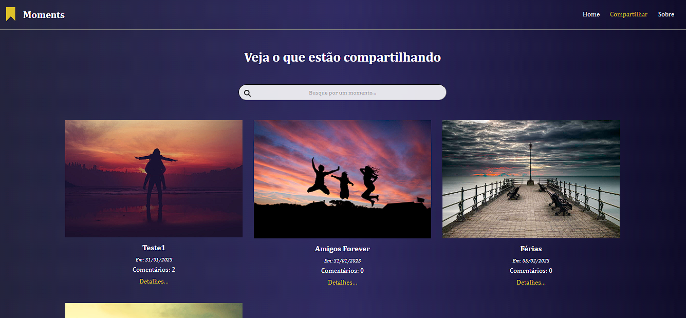
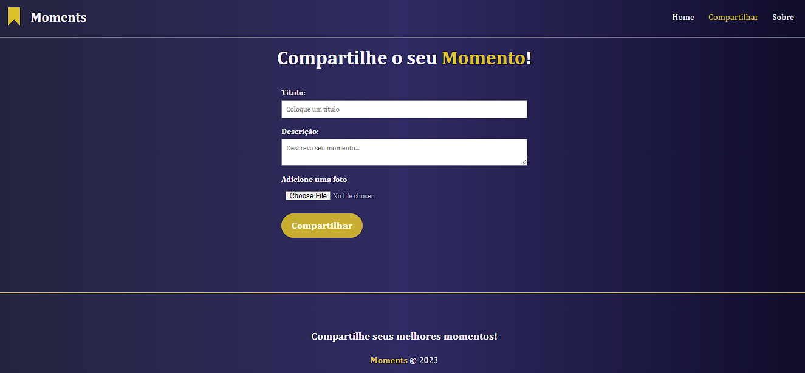
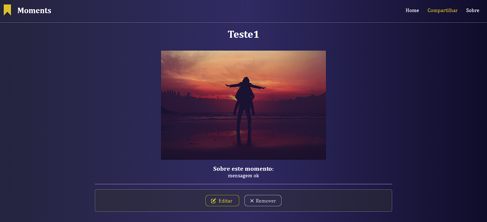
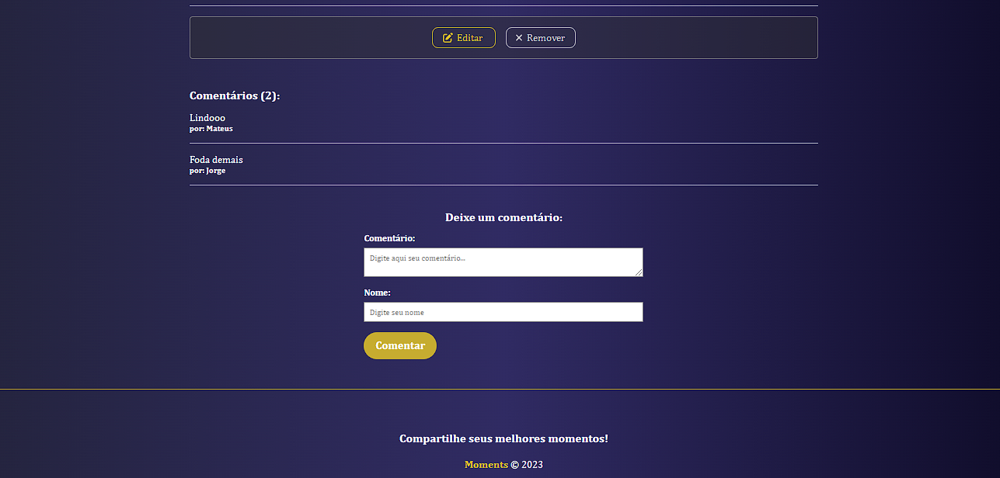

# Moments Project

This project aims to create a platform where users can share their best moments with their friends. The system allows users to share their publications, edit, remove, search publications and comment.

This is a study project to practice developing web applications, focusing on the use of the Rest API and the use of Angular on the front-end. The system is simple, but it allows users to share their best moments with their friends in an easy and intuitive way.

The project was developed along with the classes provided by Matheus Battisti on the Hora de Codar channel on Youtube.
- [Back-end Classes](https://www.youtube.com/watch?v=y8XfJJYhXPE&t=1048s)
- [Front-end Classes](https://www.youtube.com/watch?v=vJt_K1bFUeA&list=PLnDvRpP8Bnex2GQEN0768_AxZg_RaIGmw)

This project was a great opportunity to practice developing web applications using Angular and AdonisJS. I hope this project can be useful for other developers who want to learn about these technologies.

## Technologies Used
The front-end of the project was developed using Angular and a component-based architecture.

In the back-end, the basic features of AdonisJS, a Node.js framework, were explored. An MVC architecture was adopted to develop a RESTful API and the SQLite database was used to store the data.

*Note: **AdonisJS** is a Node.js framework. It contains features like CLI, file upload, validations, etc.*

## Functionalities
- Share moments
- Edit moments
- Delete moments
- Search moments
- Comment in moments

## Requirements
To run this project, you will need to have installed:

- Node.js, choose the latest version (https://nodejs.org/).
- Angular CLI (https://cli.angular.io/).

## How to use
### Back-end
1. Navigate to the project's "moments-back" folder;
2. Run the `npm install` command to install the facilities;
3. To run, you need to create an environment variable called "APP_KEY";
    1. Open the terminal and type `node ace generate:key`;
    2. Copy the key that was generated;
    3. Open the file called `.env`;
    4. In "APP_KEY" replace the key that is there with the one that was generated. 
4. Run the `node ace serve` command to start the application.
5. The application will be available at "http://localhost:3333/".
### Front-end
1. Navigate to the project's "moments-front" folder;
2. Run the `npm install` command to install the facilities;
3. Run the `npm start` command to start the application;
4. The application will be available at "http://localhost:4200".

 

  
  
Figure 1: Home page

  
  
Figure 2: Share page

  
  
Figure 3: Moment page

  
  
Figure 4: Moment page

